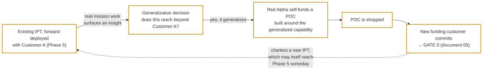

# 01 — Ideation: Where the Idea (and the POC) Come From

*Status: Draft for discussion — v0.1 — August 2026*

## Why this document exists

Every other document in this knowledge base starts from the same assumed starting point: **a POC already exists, and a customer has committed to fund turning it into an MVP.** That is a deliberate boundary — document 05's Gate 0 is specific and well-defined precisely because it does not also have to cover speculative, self-funded exploration. But it leaves the very first question unanswered: **where does the idea come from in the first place?**

This document is the missing front end. It does not replace anything — Gate 0 in document 05 is still where the documented, gated process begins — it explains what happens *before* that, so the whole team understands where a POC's first idea actually originates.

## Where the idea comes from

**The idea does not come from a whiteboard exercise or an internal brainstorm. It comes from a Red Alpha development team already embedded in a customer's space, working a real mission for that customer.**

Concretely, the path looks like this:

1. **Field-sourced insight.** A Red Alpha team — typically an existing IPT already working **forward-deployed** with a customer (document 02 §6; document 04's Phase 5) — builds a solution to solve that customer's actual, specific problem. This work is funded by and belongs to that customer's mission. Nobody sets out to "build a POC" at this stage; the team is solving the problem in front of it.
2. **The generalization question.** While solving it, the team (and Red Alpha leadership) asks whether what was learned or built reaches beyond that one mission — does it address a capability gap other customers plausibly share too? Most mission-specific work stays mission-specific. Occasionally, something generalizes.
3. **A self-funded POC, built to be someone else's.** When it does, Red Alpha internally funds and builds a **POC** around the generalized capability — a distinct, Red Alpha-owned artifact built for a *different, future* customer, not a repackaging of the original customer's specific deliverable or data. This is the same POC every other document already assumes: Red Alpha-funded, Red Alpha-owned outright, shopped until a new funding customer commits (document 03, document 07 — glossary).

The through-line: **ideation is not a separate function sitting apart from delivery — it is a byproduct of doing forward-deployed work well.** The same posture that makes Phase 5 valuable (document 04) — staying close enough to a customer's operators to find real leverage points — is also what surfaces the next product's idea.

## Why this makes the loop worth naming explicitly

This creates a deliberate loop, not a one-way pipeline:

Today's forward-deployed work is tomorrow's idea. That is worth saying out loud to the whole team, not just leadership: the embedded, mission-focused work an IPT does in Phase 5 is not separate from "innovation" — it is where innovation actually comes from at Red Alpha.

## What this document does not settle

The origin story above answers *where an idea comes from*. It deliberately does not answer several real operational questions that remain open — these are **not** invented here, and they stay tracked in document 08 (open items) alongside the rest of OI-01:

- **The generalization bar.** Who decides a mission-specific solution is "generalizable enough" to justify a self-funded POC, and what does that decision actually weigh?
- **Staffing.** Does the POC get built by the same embedded team that surfaced the insight (who are presumably still committed to the original customer's mission), or does it move to a separate team?
- **Duration and exit criteria.** How long does POC development typically run, and what must it prove before it's ready to shop?
- **Who shops it.** Business development, the original IPT, the Product Owner who sponsored the insight — or some combination?
- **Contractual clarity with the originating customer.** Our terms need to be clear that Red Alpha may generalize an underlying capability learned while serving one customer into a POC for another, without implicating that customer's specific data or deliverable. This is a distinct question from OI-07 (upstreaming customer-funded tailoring into the core *within* one engagement) and should be tracked separately.

## Read next

[`02-research-brief-incubator-methodologies.md`](02-research-brief-incubator-methodologies.md) (§6 in particular, on Forward Deployed Engineering) explains the practice this document's origin story depends on. [`05-process-timeline-and-phases.md`](05-process-timeline-and-phases.md) picks up exactly where this document leaves off, at Gate 0.
