# 01 — Where the IP Comes From: Contract-Derived IP and Legal Clearance

*Status: Draft for discussion — v0.5 — September 2026*

## Why this document exists

Every other document in this knowledge base starts from the same assumed starting point: **something shoppable already exists, and a new customer has committed to fund turning it into an MVP for their mission.** That is a deliberate boundary — document 05's Gate 0 is specific and well-defined precisely because it does not also have to cover the unfunded work of getting to that point. But it leaves the first question unanswered: **where does the shoppable thing come from, and on what basis is it ours to shop?**

This document is that front end. It does not replace anything — Gate 0 in document 05 is still where the gated, funded process begins — it explains what happens *before* that, and it names the one hard stop that stands in the way.

## The asset is intellectual property, and it usually already exists

The central fact of Red Alpha's front end is this: **the thing we take to a new customer is most often IP we have already built and already been paid to build.** It comes out of delivering real work on a real contract for a real customer. The capability, the architecture, the integrations, the hard-won operational lessons — all of it is produced in the course of solving one customer's mission problem, and some of it turns out to solve a problem other customers have too.

That is the primary route, and it is the route to plan around. Red Alpha *can* spend its own money building a proof of concept from scratch, and sometimes will — that path is described further down — but it is the exception, not the model. The ordinary case is that the asset already exists, already works, and has already been funded by the customer whose mission produced it.

Two consequences follow immediately, and the rest of this document is about them:

- **The economics are usually far better than a self-funded build.** Where the capability was built under a funded delivery contract, the origin cost was already paid by that engagement, and what Red Alpha spends is the marginal cost of generalizing and packaging rather than the full cost of invention. (The CRADA route is the exception — see below — because under a CRADA the government does not fund us at all.)
- **The ownership question is far harder than a self-funded build.** IP produced under someone else's contract is not automatically ours. A POC Red Alpha funds outright carries no ambiguity about who owns it; contract-derived IP carries that ambiguity by default. **This is the trade, and it is why RA Legal is not optional here.**

## The route, step by step

1. **Delivery on an existing contract.** A Red Alpha team is embedded and delivering for a customer — often an existing IPT working **forward-deployed** in Phase 5 (document 02 §6; document 04). It builds what that customer's mission actually needs. Nobody sets out to "create IP" at this stage; the team is solving the problem in front of it, and the work is funded by and delivered to that customer.

2. **The generalization question.** While solving it — or after — the team and Red Alpha leadership ask whether what was learned or built reaches beyond that one mission. Does it address a capability gap other customers plausibly share? Most mission-specific work stays mission-specific. Occasionally, something generalizes: a pattern, a component, an integration approach, a body of operational knowledge about how a class of problem behaves under real conditions.

   What generalizes is the capability, across **mission spaces** that are genuinely different. A worked example: Red Alpha builds a tool for **Army Cyber** that addresses a real problem in their mission. The underlying capability turns out to apply just as well to a **Navy Cyber** mission — a different organization, a different mission space, different mission requirements, different data and integrations — but the same tool solves the same class of problem in both. That is what "generalizes" means here, and it is the case worth recognizing early, because it is where the rest of this document starts.

3. **The IP position, determined by RA Legal.** Before anything is shopped, Red Alpha establishes *in writing* what its rights in that IP actually are. This is the hard stop described in the next section, and it has exactly three acceptable answers.

4. **Matching it to a mission requirement, and shopping it.** Once the rights are settled, the IP is matched against prospective customers' **mission requirements** — we are looking for a customer whose stated mission problem this capability solves — and shopped, demonstrated in working form so the conversation is about software rather than slideware. **The job of that demonstration is to establish applicability**, concretely enough that both sides can see the capability addressing this customer's problem. When it does and the customer commits funding to have it adapted to their **mission space**, that commitment is **Gate 0** and document 05 takes over — and what they are funding from there is the *tailoring*, not a further test of whether the capability was the right one.

## The IP clearance checkpoint — the one hard stop before Gate 0

Stage 0 is deliberately ungated: subjecting exploratory, unfunded work to charter-and-gate machinery built for funded delivery would slow down exactly the work that needs to stay cheap and fast. **There is one exception, and it is absolute.**

> **No shopping before clearance.** Contract-derived IP is not shopped, demonstrated to a prospective customer, or represented as Red Alpha's to build on until **RA Legal has reviewed the originating contract and recorded a determination that Red Alpha may use it.** This is not a formality and not a post-hoc sign-off. It happens before the first conversation with a prospect, because the first conversation is already a use.

**The shorthand, and one caution about it.** These documents call that determination an **IP clearance**, and IP that has one **cleared IP**. The shorthand is convenient and it is used throughout — but in a defense and government context "cleared" ordinarily means *security*-cleared, so it is worth being blunt about the difference before going further.

> An **IP clearance is a legal determination about ownership and permission**: may Red Alpha use this. It is **not** a security clearance, and it says nothing about a capability's classification level, its releasability, or who is cleared to see it.
>
> The two are independent, and both may apply to the same capability. IP can be legally cleared and still be classified; it can be unclassified and still not be ours to use. Different people make the two determinations, and neither substitutes for the other in either direction. Where these documents mean the security sense, they say so.

**The three acceptable positions.** RA Legal's determination must land on one of these, in writing:

- **Red Alpha owns the IP outright** under the terms of the originating contract — the contract assigns or retains ownership with us, and we may use, license, and modify it without further permission.
- **The originating customer has released the IP** for Red Alpha's own use. The customer holds or held rights and has explicitly granted us the ability to use the capability for our own purposes, including with other customers. A release is a document, not an understanding between two program managers.
- **A CRADA is in place.** A **Cooperative Research and Development Agreement** (15 U.S.C. § 3710a) — negotiated before or during the work rather than after it — establishes from the outset that Red Alpha keeps the IP arising from the collaboration. Where one is available and we can see generalizable value coming, it is the cleanest of the three, because it settles the question while everyone still agrees on the answer. It is also the narrowest, for two reasons set out immediately below.

**Anything else is a stop.** If Legal cannot place the IP in one of those three positions, the capability stays with the originating engagement. It is not shopped, not demonstrated, and not used as the basis of a new build, until the position is fixed — by renegotiating terms with the originating customer, by seeking a release, by putting a CRADA in place, or by rebuilding the capability independently and cleanly. Proceeding anyway is not an acceptable risk: it puts the originating relationship, the new engagement, and the licensed core product all at risk at once.

**Two things about CRADAs that the other two positions do not share.** They are worth stating plainly, because a CRADA is easy to reach for rhetorically and harder to reach for in practice.

*It is a federal-laboratory instrument, not a general contracting vehicle.* A CRADA is an agreement between one or more **federal laboratories** and one or more non-federal parties, created under Stevenson-Wydler for technology transfer out of government labs. Where the originating customer is or acts through a federal laboratory, it is available and it is excellent. Where they are a program office, a command, or any other component without laboratory status, **it may simply not be on the table** — and the position will have to be ownership under the contract's own terms or an explicit release instead. Nobody should plan a capability's IP position around a CRADA before confirming with RA Legal that the originating customer can actually enter one.

*It is an IP instrument, not a funding one.* Under a CRADA the government **may not provide funds to the non-federal party**. It can contribute personnel, facilities, equipment, data, and its own intellectual property; it cannot pay us. That makes the CRADA route economically different from the other two in a way worth being honest about: the argument for contract-derived IP generally is that *someone else already paid for the work*, and under a CRADA that is not what happened — Red Alpha contributed its own effort and kept the resulting rights. The IP position is arguably the strongest of the three; the cost was ours. Both of those things are true at once, and a plan that quietly assumes the funding half of the argument while relying on a CRADA for the rights half is a plan with a hole in it.

**What clearance is scoped to.** A determination covers a defined body of IP for a defined kind of use. It is not a blanket permission for everything the team ever learned on that contract, and it does not extend automatically to the originating customer's **data**, their specific deliverable, or their mission details — those remain theirs regardless of how the capability itself is cleared. What we generalize is the capability, never the customer.

## The secondary route: an internally funded POC

Red Alpha can also fund a **proof of concept** outright — spending its own money to build something from scratch against a capability gap it believes exists, with no originating contract behind it. This route is real and it stays in the model. It has one clear advantage: **the IP question is trivially settled**, because Red Alpha paid for all of it and owns it outright with nothing to clear.

It is, however, the less likely path, and the model should be read that way. A self-funded POC spends scarce Red Alpha money and scarce Red Alpha people on an unproven bet, competing directly with funded delivery for both. Contract-derived IP starts from something that already works, for a customer who already needed it — which is a much better place to start a sales conversation and a much cheaper place to start a build.

The honest way to hold both: **contract-derived IP is the model; the self-funded POC is the fallback** for a capability we are convinced matters and cannot reach any other way.

## What we actually shop, and what a POC is now for

Under this model the word **POC** shifts meaning slightly, and it is worth being precise so the team does not talk past itself.

A POC is now most often **a demonstration assembled from cleared IP** rather than a build undertaken from nothing. We take generalized, cleared capability and package it into something a prospective customer can see working against a realistic version of *their* problem — enough to make the mission-requirement match concrete. That packaging costs real time and should be planned for, but it is a fraction of the cost of inventing the capability, which is precisely the point of sourcing from contract work.

What we take to a prospective customer, then, is:

- **Cleared IP** — with Legal's determination on record, scoped and dated.
- **A working demonstration of it** — run in a **stage** instance Red Alpha controls, on synthetic data. Never the originating customer's data, whatever the IP position says (document 06).
- **A claim about their mission requirement** — a specific statement of what problem of *theirs* this addresses, which is what they are actually evaluating.

## The loop this creates

This is a loop, not a one-way pipeline. Today's funded delivery is tomorrow's shoppable IP.

```mermaid
flowchart LR
    accTitle: Contract-derived IP flowing from an existing engagement, through legal clearance, into a new engagement at Gate 0
    accDescr: An existing IPT delivers forward-deployed work on Customer A's contract. That work produces capability and lessons learned. Red Alpha asks whether it generalizes beyond Customer A. If it does, RA Legal determines the IP position, which must be Red Alpha ownership, a customer release, or a CRADA. Cleared IP is matched to a new customer's mission requirement and shopped. A funding commitment from that new customer is Gate 0 of the documented workflow, which charters a new IPT that may itself reach Phase 5 and start the loop again. IP that cannot be cleared stops and stays with the originating engagement.

    A["Existing IPT delivering<br/>on Customer A's contract<br/>(Phase 5, forward-deployed)"]
    G["Does the capability generalize<br/>beyond Customer A's mission?"]
    L["RA LEGAL — IP position<br/>RA owns it · customer released it · CRADA"]
    X["NOT CLEARED — stays with<br/>the originating engagement<br/>until the position is fixed"]
    P["Cleared IP packaged<br/>as a working demonstration"]
    S["Shopped against a new customer's<br/>stated mission requirement"]
    N["New customer commits funding<br/>to build out their MVP<br/>→ GATE 0 (document 05)"]

    A -- "funded delivery produces<br/>capability and lessons learned" --> G
    G -- "yes" --> L
    L -- "cleared, in writing" --> P
    L -- "cannot be cleared" --> X
    P --> S
    S --> N
    N -. "charters a new IPT,<br/>which may itself reach<br/>Phase 5 someday" .-> A

    classDef loop fill:transparent,stroke:#c98500,stroke-width:2px
    classDef legal fill:transparent,stroke:#3987e5,stroke-width:2px
    classDef stop fill:transparent,stroke:#e8594f,stroke-width:2px,stroke-dasharray:5 4
    class A,G,P,S,N loop
    class L legal
    class X stop
```

The through-line worth saying out loud to the whole team: **ideation is not a separate function sitting apart from delivery — it is a byproduct of doing funded, embedded work well.** The same posture that makes Phase 5 valuable (document 04) — staying close enough to a customer's operators to find real leverage — is also what produces the next product's IP. What the posture cannot produce on its own is the *right* to use it. That part is Legal's.

## What this document does not settle

The route above answers where the IP comes from and on what basis we may use it. It deliberately does not answer several real operational questions, tracked in document 08 (open items):

- **The generalization bar.** Who decides a capability built for one customer is "generalizable enough" to be worth pursuing, and what does that decision weigh? (OI-01)
- **Who triggers and runs the Legal review**, what a determination must contain to be usable, and how long it takes. A clearance process nobody can predict the duration of will be routed around. (OI-27)
- **When we pursue a CRADA proactively.** A CRADA negotiated up front is far cheaper than a release argued for afterward — but it has to be raised while the originating contract is being written, which means someone has to spot the possibility that early. (OI-28)
- **What we do with valuable IP we cannot clear.** Renegotiate, seek a release, rebuild clean, or drop it — and who makes that call. (OI-29)
- **Packaging.** Who builds the demonstration from cleared IP, how long that runs, and what it must show to be worth a prospect's time. (OI-01)
- **Who shops it.** Business development, the originating IPT, the Product Owner — or some combination. (OI-01)
- **Standard contract terms.** What our terms with originating customers should say by default about Red Alpha generalizing capability learned on their work, so clearance is the normal case rather than a negotiation each time. (OI-26)

## Read next

[`02-research-brief-incubator-methodologies.md`](02-research-brief-incubator-methodologies.md) (§6 in particular, on Forward Deployed Engineering) explains the delivery practice this document's origin story depends on. [`05-process-timeline-and-phases.md`](05-process-timeline-and-phases.md) picks up exactly where this document leaves off, at Gate 0. [`07-glossary-and-references.md`](07-glossary-and-references.md) defines **contract-derived IP**, **IP clearance**, **CRADA**, and the terms around them.

## Changelog

- v0.5 — 2026-09-22 — corrected the framing of what the MVP is for: applicability is established by the demonstration *before* Gate 0, so the MVP funds **tailoring into a new mission space**, not a test of whether the capability applies. Added the Army Cyber / Navy Cyber worked example and the **mission space** term.
- v0.4 — 2026-09-22 — introduced **cleared** as a shorthand only at the point where clearance is explained, rather than in the opening, and disambiguated it there from *security*-cleared — which is what the word defaults to meaning for this audience. Opening paragraphs now say "IP Red Alpha has the right to use" in plain terms.
- v0.3 — 2026-09-22 — qualified the CRADA position: it is a federal-laboratory instrument under 15 U.S.C. § 3710a (so unavailable where the originating customer lacks lab status) and not a funding vehicle (the government may not pay the non-federal party), which makes its economics different from the other two positions. Reflected in OI-28.
- v0.2 — 2026-09-22 — reframed around **contract-derived IP** as the primary origin, with RA Legal's **IP clearance** as a hard precondition to shopping and three acceptable ownership positions (RA ownership, customer release, CRADA). The internally funded POC is retained as the secondary route. Document renamed from `01-ideation-and-poc-origin.md`.
- v0.1 — 2026-08-31 — initial document: ideation as the origin of a self-funded POC.
