# 03 — The Red Alpha Idea-to-Product Model

*Status: Draft for discussion — v0.3 — September 2026*

## What this document is

This is the heart of the knowledge base: Red Alpha's **standard model for turning a proven concept into a real, supportable, licensable software product** — by way of a customer-funded MVP tailored to that customer's mission. It defines what we mean by an Integrated Project Team, the principles that govern how one operates, when one stands up, and how the whole thing fits together. Documents 04, 05, and 06 then detail the team, the timeline, and the security dimension respectively.

## What an Integrated Project Team is, in our terms

The IPT concept comes from disciplined acquisition practice, most often under the name **Integrated Product Team** — a **multi-disciplinary team whose members come from every function needed to make a decision and own an outcome**, working together rather than passing work over walls between departments. Red Alpha calls its version an **Integrated Project Team**; the underlying concept and its recognized best practices are the same, and they're directly relevant to us: keep the team **small**, make **roles and responsibilities explicit** up front, set **clear goals**, and lead through **shared accountability and consensus** rather than command.

For Red Alpha, we adopt that spirit and make it concrete:

> A Red Alpha IPT is a small (4–7 person), cross-functional, and durable team that owns a single product from the moment a customer funds its development through launch and into sustained operation. It contains — in people or in hats — every skill needed to design, build, secure, ship, and support the product, so that the team almost never has to wait on an outside function to make progress.

Two words in that definition carry weight. **Cross-functional** means the team is not "the engineers plus some help"; product, design, engineering, security, and operations judgment all live inside the team. **Durable** means the team stays with the product — we do not disband and reform around projects, because the accountability and context that make an IPT valuable are exactly what get destroyed by constant reshuffling.

## The core philosophy

Everything below follows from one belief drawn from the research in document 02: **the expensive mistake in software is building the wrong thing well.** So the model is organized around two disciplines that reinforce each other:

1. **Reduce uncertainty cheaply, before committing.** Before we spend a customer's money on build cycles, we force the important questions — Who is this for? What outcome does it deliver? Is it desirable, feasible, and viable? Can it be secured and authorized in their environment? — to be answered on paper or with a throwaway prototype, where changing our minds is nearly free. (Amazon's PR/FAQ, Google's sprint, IDEO's discovery.)
2. **Then let a small, empowered team own delivery end to end.** Once we commit, a single IPT owns the outcome, works in fixed-time / variable-scope cycles, and is trusted to decide *how* while being held to *what* and *why*. (Spotify's autonomy, Basecamp's appetite and circuit breaker, Amazon's single-threaded ownership.)

The second discipline has a corollary we take seriously once a customer is paying: **uncertainty gets reduced repeatedly, not once.** During the MVP phase every short cycle ends with working capability the customer can actually use, and their reaction shapes the next cycle. A customer who reviews five increments has five cheap opportunities to redirect us; a customer shown one finished product has one expensive one.

## Guiding principles

These are the principles a Red Alpha IPT is expected to live by. They are the standard against which we review how a team is operating.

**Customer/mission outcome first.** Work begins from a clearly stated problem and the outcome we intend to deliver, written down and defensible, not from a feature wish-list. If we cannot articulate the outcome plainly, we are not ready to build.

**One team, one mission, end-to-end ownership.** The IPT owns the product from the customer's first funded cycle through operation. There is no "throw it over the wall to ops" — the people who build it help run it. This is what makes security and quality real rather than someone else's problem.

**Earn the customer's confidence in increments.** Once a customer is funding the work, they see working capability they can use at the end of every short cycle, and their evaluation steers the next one. We do not ask for approval of a finished product; we ask for approval of a direction, repeatedly, while changing course is still cheap. A customer should never be more than one cycle away from being able to redirect us — or to stop.

**Know whose money you are spending.** Every piece of work carries a funding source and a core-or-tailored designation, and every decision to promote customer-funded capability into the licensed core is recorded with its reasoning. This protects the customer from paying for our product and protects Red Alpha from giving it away by accident.

**Fixed time, variable scope.** We budget *appetite* (how much a piece of work is worth) rather than chasing fixed scope on a slipping schedule. When time runs out, scope flexes and we ship the most valuable slice — we do not silently extend.

**Secure and authorizable by design.** Because our products may serve defense and government customers, security and the path to authorization are designed in from the first cycle, not bolted on before launch. Compliance is a continuous property of how we build, not a gate we sprint toward at the end. (See document 06.)

**Autonomy with alignment.** The team decides how it works. In exchange, it commits to shared standards — for engineering, security, and quality — that let Red Alpha stay coherent as more IPTs form. Trust and ownership are cultural, not merely structural; renaming a team an "IPT" changes nothing by itself.

**Small, explicit, accountable.** Keep the team small. Make each person's role and responsibilities explicit. Lead through shared accountability. Empower a single decision-maker to break ties so a lean team never stalls waiting for consensus.

**Make progress visible.** Uncertainty and status are surfaced honestly — what's still being figured out versus what's just execution — so problems appear while they are still cheap to fix.

## Two things we own separately: the core product and the tailoring

Before the lifecycle makes sense, one structural fact has to be stated plainly, because it shapes how the money and the ownership work.

Red Alpha builds and **owns a core product**, which it **licenses** to customers. What a customer funds is not the core — it is the **tailoring**: the integrations, data feeds, deployment work, and mission-specific workflows that adapt the core into *their* **mission space**. That is the "make it work here" development, and it is exactly what a customer is willing to pay for, because it is the part that stands between a capability they can already see working and one their operators can actually use.

A distinction worth holding onto, because it shapes how the whole engagement is pitched and run: **the customer is not funding us to find out whether the capability applies to their mission.** That is established before they commit — it is what the demonstration is for. They are funding the gap between a capability proven in one mission space and a capability that works in theirs, which is real, often substantial, and mostly invisible until their people start using it.

Three consequences follow:

- **The core stays ours.** Customer-funded tailoring does not transfer the core product. The customer receives a licensed, working instance tailored to their mission.
- **Tailoring is not assumed to be core.** Much of it is specific enough that it never belongs in the licensed product, and that is a normal outcome. Whether any given capability is **upstreamed** into the core is a separate decision, made when the answer is clear and recorded in the **upstream log** with its reasoning.
- **Both streams run at once.** Red Alpha keeps funding core-product work while the customer funds tailoring — one team, one backlog, two funding sources, every piece of work tagged. Keeping that split honest is an obligation in both directions, and it is the Product Owner's to own (document 05).

The return on all of this is compounding: each engagement pays for the tailoring while Red Alpha's own investment turns a proven capability into something the *next* customer can license with far less work.

**And the core does not usually start from nothing.** Where the capability underneath a core product most often comes from is the subject of document 01: **IP derived from work Red Alpha has already delivered under an existing customer contract**, generalized beyond that one mission and confirmed by RA Legal as ours to use. That is what makes the compounding real rather than aspirational — the origin cost was already funded by the engagement that produced it. It also introduces the one obligation that a self-funded build would not carry: **Red Alpha's right to use that IP has to be established in writing before any of it is shopped.** Three positions are acceptable — Red Alpha owns it under the originating contract, the originating customer has released it, or a **CRADA** secures it — and RA Legal makes that determination. There is no fourth position and no proceeding without one.

## Where the model begins — ideation, then Gate 0

The model does not begin at Gate 0 — **it begins with IP we already have.** A Red Alpha team delivering on an existing customer's contract builds a solution to that customer's real problem; when the underlying capability generalizes beyond that one mission, **RA Legal establishes Red Alpha's right to use it**, and the cleared IP is matched against another customer's mission requirement and shopped. Red Alpha may also self-fund a POC outright, which settles the ownership question trivially but spends its own money to do so — the secondary route, not the model. Both are documented in [`01-ip-origin-and-clearance.md`](01-ip-origin-and-clearance.md); that stage is real process, not input sitting outside the model.

What *is* kept outside this model's gates is everything before a customer commits money:

> **Entry condition:** A body of IP that is **Red Alpha's to use, with RA Legal's determination on record** — what these documents call **cleared IP** (a legal determination about rights, not a security clearance; document 01) — has been demonstrated to a prospective customer against a stated mission requirement, and that **funding customer** has committed to pay for building it out as an **MVP** tailored to their environment and mission — meaning there is a real mission need, a plausible path to being desirable, feasible, viable, *and* securable/authorizable in that environment, and Red Alpha is willing to commit a durable team.

Keeping that front end out of the *gated* part of the model is a deliberate choice, not an oversight: subjecting exploratory, unfunded work to charter-and-gate machinery designed for funded delivery would be exactly the wrong trade. **It is ungated, not unconstrained** — document 01's IP clearance is a hard stop, and Gate 0 re-checks that the clearance on record still covers what this engagement intends to build on. What remains genuinely open — the generalization bar, who runs the Legal review and how long it takes, who packages the demonstration, and who shops it — is listed in the open questions below.

The payoff of that boundary is that from Gate 0 onward there is a customer, a budget, and a durable team — so the model can be specific about all three.

The full lifecycle, gates, and timeline are in document 05. In brief, the arc is:

```mermaid
flowchart TD
    accTitle: The IPT lifecycle, from cleared and shopped IP through five gated phases to sustained operation
    accDescr: Cleared contract-derived IP, described in document 01, sits outside this model's gates and is shopped until a customer funds the next stage. Gate 0 charters the IPT, then five phases follow — Discovery and Framing, MVP, Build, Launch, and Operate and Iterate — each closed by the next numbered gate. Gate 2 is the funding customer's decision.

    IP["PRE-GATE-0 · SEE DOC 01 — Red Alpha's own cost<br/>IP derived from an existing contract, cleared by RA Legal, packaged and shopped<br/>until a customer funds the build-out (or, less often, a self-funded POC)"]
    D["PHASE 1 · DISCOVERY AND FRAMING — both wallets<br/>PR/FAQ with the customer · validate the riskiest assumptions<br/>draw the core/tailoring boundary · stand up stage"]
    M["PHASE 2 · MVP, the tailoring — the customer's money<br/>Short 2–3 week cycles, each ending with working<br/>capability in stage for the customer to evaluate"]
    B["PHASE 3 · BUILD — both wallets, two tracks, one team<br/>core product (Red Alpha-funded) + tailoring (customer-funded)<br/>upstream decisions move capability into the core"]
    L["PHASE 4 · LAUNCH — both wallets<br/>Into the customer's real environment; prove it there"]
    O["PHASE 5 · OPERATE AND ITERATE — both wallets<br/>Run, monitor, iterate · continuous authorization<br/>renew, scale, or sunset"]

    IP -. "GATE 0<br/>Commit and charter" .-> D
    D -- "GATE 1<br/>Green-light the MVP" --> M
    M -- "GATE 2<br/>Customer acceptance<br/>the customer's decision" --> B
    B -- "GATE 3<br/>Authority and readiness<br/>to launch" --> L
    L -- "GATE 4<br/>Sustainment and<br/>continuous authorization" --> O

    classDef outside fill:transparent,stroke:#e8594f,stroke-width:1.5px,stroke-dasharray:5 4
    classDef customer fill:transparent,stroke:#3987e5,stroke-width:2px
    classDef both fill:transparent,stroke:#c98500,stroke-width:2px

    class IP outside
    class M customer
    class D,B,L,O both
```

*Outline color marks whose money pays: dashed red for Red Alpha's own cost, pre-Gate-0 and outside this model's gates (see document 01); blue for the customer's alone; gold where both wallets are open. Each phase also names its funding source in text, so the color is a shortcut rather than the only way to read it. **Gate 0 opens the work; after that, Gate N closes Phase N.***

## How the pieces fit

The model is deliberately simple to hold in your head: a **small durable team** (document 04) moves a product through **clearly gated phases on a predictable cadence** (document 05) — Red Alpha's money proving the concept, then the customer's money tailoring it for their mission in short reviewable increments, then both funding the productized result — with **security and authorization designed in throughout** (document 06), all guided by the principle of **cheap validation before committed delivery** that we drew from the best practitioners (document 02). Upstream of all of it sits the asset the whole thing runs on: **cleared IP, most often derived from work a previous customer already funded** (document 01).

## Open questions / to resolve

*These items are also tracked — with owners, decision owners, and what "resolved" looks like — in [`08-open-items.md`](08-open-items.md), the register the whole team works from.*

- **Running the front end:** [`01-ip-origin-and-clearance.md`](01-ip-origin-and-clearance.md) now documents where the IP comes from and what clearing it requires. Still open: who decides a capability generalizes, who triggers and runs the Legal review and how long it takes, who packages the cleared IP into a demonstration, and who shops it.
- **What our standard originating-contract terms should say by default** about Red Alpha generalizing capability learned on a customer's work — so clearance is the normal case rather than a negotiation each time, and so a **CRADA** gets raised while the contract is being written rather than after the fact.
- What do our standard customer terms say about **upstreaming** customer-funded capability into the licensed core? The model assumes it is permitted with agreement; the contract has to actually say so. Related to, but distinct from, the originating-IP question above: one is about the *source* of the core, the other about what a *current* engagement adds to it.
- Should every product get a *durable* IPT, or do some smaller efforts get a time-boxed team that disbands? (Trade-off between focus and headcount.)
- How many IPTs can Red Alpha realistically staff at once given our size, and what's the rule when demand exceeds that? Related: can one IPT carry two funding customers' tailoring?

*Definitions of terms used here are in [`07-glossary-and-references.md`](07-glossary-and-references.md).*
