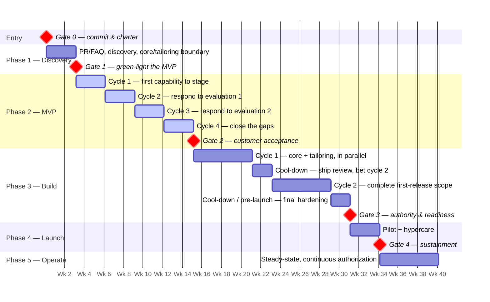

# 04 — The Process: Timeline, Phases, and Gates

*Status: Draft for discussion — v0.2 — August 2026*

## How to read this document

This is the step-by-step process a Red Alpha IPT follows to take a **proof of concept** to a shipped, operating, licensable product — by way of a **customer-funded MVP** tailored to that customer's mission. It is organized as **five phases separated by five gates**. A *phase* is a period of work with a clear purpose; a *gate* is a short, explicit decision point where the accountable parties decide whether to continue, adjust, or stop. Gates are what keep a lean team honest — they are the cheap moments to change course. The numbering is deliberate and worth memorizing: **Gate 0 opens the work, and after that Gate N closes Phase N.**

Two things about this process are easy to miss and matter more than anything else in it:

**The POC and the MVP are different stages, funded by different people.** The POC is Red Alpha's own investment, built to prove an idea and then shopped for a customer willing to fund the next step. The MVP is that customer's investment, spent tailoring our core product to their environment and their mission. Both take real time and both are necessary — the POC earns a customer's interest, the MVP earns their commitment. Treating them as one thing is how teams end up asking a customer to fund something they have never used, or demoing a POC as though it were a product. The full contrast is tabulated in [`06-glossary-and-references.md`](06-glossary-and-references.md).

**The MVP is delivered incrementally, not revealed at the end.** Once a customer is paying, we do not disappear for three months and come back with a product. We work in short cycles, and each one puts working capability into a **stage** environment the customer's own people can use. They evaluate it, they tell us where we have it wrong, and that shapes the next cycle. The customer approves the *direction* repeatedly, in small increments, rather than passing judgment once on a finished thing. This is the single most important protection for both sides: they are never far from being able to stop, and we are never far from knowing whether we are building what they will actually want.

Throughout, the process follows the two disciplines from document 02: **reduce uncertainty cheaply before committing, then let the team own delivery in fixed-time cycles.** Security is not a phase; it runs across all of them (document 05).

A note on time: the durations below are **defaults for a typical lean product**, not mandates. The fixed-time / variable-scope principle means we hold the *time* roughly steady and flex the *scope*. Adjust the numbers to the product, but keep the shape.

---

## Where this workflow starts (and what sits outside it)

This document covers **an IPT taking a POC to product**. It begins at the moment a customer commits money, and everything before that is treated as input rather than process.

What we assume already exists when Gate 0 convenes:

- **A POC** — something Red Alpha funded and built itself, which demonstrably works and addresses a customer need or capability gap specific enough that it could have been wrong. It is a demonstration, not a product: Red Alpha-controlled environment, synthetic or sample data, nobody operating it.
- **A funding customer** — a customer who has seen the POC and will pay to have it turned into an MVP for their environment and their mission.

**How a POC comes to exist is deliberately out of scope here.** The decision to fund one, who staffs it, how long it runs, what it must prove, and how it gets shopped to prospective customers are all real questions — but they belong to Red Alpha's broader ideation-to-product concept, which we have not documented yet. Bolting them onto this workflow would mean subjecting speculative, self-funded exploration to charter-and-gate machinery built for funded delivery, which is exactly the wrong trade. See the open questions: closing that gap is the most significant piece of unwritten work around this document.

What this boundary buys us is focus. From Gate 0 onward there is a customer, a budget, and a durable team — and the process can be specific about all three.

> **Entry condition:** A POC has proven the idea against an identified customer gap, and a funding customer has **committed** (not merely indicated interest) to pay for turning it into an MVP tailored to their environment and mission.

---

## At a glance

| Phase | Purpose | Funded by | Typical duration | Ends at |
|-------|---------|-----------|------------------|---------|
| *(entry)* | A POC exists; a customer commits funding; charter the IPT | — | ~1 week to charter | **Gate 0 — Commit and charter** |
| **1. Discovery & Framing** | Frame the outcome with the customer; draw the core/tailoring boundary | Customer + RA | 2–3 weeks | **Gate 1 — Green-light the MVP** |
| **2. MVP** | Tailor the core to the customer's mission, in short reviewable cycles | Customer | 3–5 cycles (~2–4 months) | **Gate 2 — Customer acceptance** |
| **3. Build** | Two tracks, one team: productize the core, continue tailoring | RA + Customer | 2–4 cycles (~3–6 months) | **Gate 3 — Authority & readiness to launch** |
| **4. Launch** | Deploy into the customer's real environment; prove it there | RA + Customer | 2–4 weeks (+ hypercare) | **Gate 4 — Sustainment** |
| **5. Operate & Iterate** | Run, monitor, improve; continuous authorization | RA + Customer | Ongoing | Renew, scale, or sunset |

---

## Gate 0 — Commit and charter

Gate 0 is both the entry decision and the week of work that follows it, which is why it is a gate rather than a phase: standing up the team *is* the act of committing, and separating the two invented ceremony without adding a decision.

**The decision.** *Decision owner: Sponsor, with the prospective Product Lead making the case.* Commit a durable IPT only if the customer's funding is genuinely committed, a 4–7 person team can be staffed with every core function owned, and the core/tailoring and licensing arrangement is understood by both sides. Otherwise: keep shopping the POC, or stop. This is a real decision, not a formality — it commits scarce Red Alpha people for the life of a product.

**The chartering work it authorizes (~1 week).** The Product Lead brings together the funded scope, what the POC proved, and the customer's stated mission need. The sponsor names the team and their hats (document 03). The Security Lead turns the POC-era security read into an initial view of the authorization path, now that a real environment and a real customer are in view. Red Alpha and the customer write down what the customer's money buys and what Red Alpha continues to fund itself.

**Artifacts produced.**
- **IPT Charter** — one page: mission, named members and their hats, the sponsor, the funding customer, decision rights, and the appetite for Discovery.
- **Funding and ownership summary** — plainly stated: the core product is Red Alpha's, licensed to the customer; the customer's money funds tailoring for their environment; upstreaming is decided case by case and recorded.
- **Initial risk & security read** — authorization constraints and unknowns for the customer's actual environment, and the likely Authorizing Official identified.

---

## Phase 1 — Discovery & Framing (and Gate 1)

**Purpose.** Before spending the customer's money on build cycles, get the outcome clear and knock down the riskiest assumptions while doing so is still cheap. This is where the Amazon, Google, and IDEO lessons do their work — and now they do it *with the customer in the room*, which makes them considerably more useful than they were in the abstract.

**Key steps.**
1. **Write the launch narrative (PR/FAQ).** The Product Lead drafts a short mock press release describing the tailored product from the customer's operators' point of view, plus an FAQ answering the hard questions — mission fit, feasibility, cost, legal, and *how it will be secured and authorized in the customer's environment*. Iterate with the customer until the outcome is clear and compelling, or the idea is honestly reworked on paper.
2. **Talk to the customer's real operators.** Not just the people who signed. The Designer (or whoever wears that hat) runs direct discovery with the people who would actually use this, and synthesizes findings into a small set of insights. Apply the desirable / feasible / viable filter explicitly.
3. **Draw the core/tailoring boundary.** Explicitly: which capabilities belong to the Red Alpha **core product** and which are **tailoring** for this customer. This is the decision that keeps the funding split honest for the rest of the engagement, and it is far easier to draw now than to argue about in month four. It will move as we learn — but it should always be written down.
4. **Validate the riskiest assumption.** For the one or two decisions that would most damage the product if wrong, run a lightweight, time-boxed **validation sprint** (a compressed Design Sprint) — map, sketch, decide, prototype a facade, and test with about five of the customer's users. Spend a prototype, not a cycle, to learn.
5. **Shape the first MVP cycle, and stand up stage.** The Tech Lead sketches the architecture at low fidelity; the Security Lead drafts the control and authorization approach (document 05). The Delivery/Platform hat stands up the `dev → stage → prod` path so that the **stage** environment is ready to receive the first increment — the customer cannot evaluate what they cannot reach. Stage lives in **Red Alpha's controlled environment** (on premises or our cloud), and is built to the customer's stage **CONOPS** if they supply one, otherwise mirroring what Red Alpha determines the production deployment will be. It may be replicated, but every instance runs the same release as the upstream mainline (document 05).

**Artifacts produced.** PR/FAQ; discovery insights from the customer's operators; the written **core/tailoring boundary**; validation-sprint results; a lightweight architecture sketch; a **security & authorization plan (draft)**; a working **stage** environment with customer access; a shaped first MVP cycle with an explicit appetite.

**Gate 1 — Green-light the MVP.** *Decision owner: Product Lead (the Decider), with sponsor concurrence and the customer's agreement on the tailoring scope.* Proceed only if the outcome is clear, the riskiest assumptions survived validation, the approach is feasible and securable in the customer's environment, the core/tailoring boundary is written down, stage is reachable by the customer, and the first cycle is shaped with an agreed appetite. Otherwise: iterate discovery, re-scope, or stop.

---

## Phase 2 — MVP (and Gate 2)

**Purpose.** Turn the POC into something the customer's own people can use for their own mission, and find out — incrementally, while it is still cheap to change — whether it is the direction they actually want. This is the phase the customer is funding, and its defining property is that they see working capability repeatedly rather than once.

**The cadence — short cycles, each ending in a customer evaluation.** Build proceeds in **short cycles of 2–3 weeks**. Shorter than Shape Up's default on purpose: the point of this phase is frequent customer contact with real software, and a six-week gap between evaluations is too long to correct a wrong direction cheaply. Within each cycle:

- The team works on the shaped, bet-on tailoring for that cycle and nothing else — protected, uninterrupted focus, including protection from the customer's mid-cycle requests, which go to the next bet rather than into the current cycle.
- **Fixed time, variable scope:** when time runs short, scope flexes down to the most valuable slice. The **circuit breaker** applies — unfinished work is not automatically extended; it must re-earn its place at the next bet.
- Progress is tracked honestly on a **hill chart**, so hidden uncertainty surfaces early rather than in a demo.
- Every cycle ends with **working capability promoted to stage** — not a slide, not a mockup, something the customer's operators can exercise against realistic tasks.

**The customer evaluation.** Each cycle closes with the customer using what shipped to stage and answering two questions: *is this right?* and *what should the next cycle change?* Their response is input to the next bet, not a change order against the current one. Some evaluations will invalidate an assumption and turn the next cycle in a new direction — that is the mechanism working, not a failure of planning. Record what they said and what we decided to do about it; over three or four cycles this record becomes the evidence for Gate 2.

**Security woven in (every cycle).** Controls are implemented as capability is built, not deferred. The pipeline enforces automated security checks, and the Security Lead keeps a live view of control status feeding toward authorization. Note that stage now holds representative or customer-supplied data and is reachable by people outside Red Alpha — it is part of the security picture, not a scratch environment. It also stays at mainline release parity, so what the customer exercises is the same release everyone else is on (document 05).

**Tailoring and the upstream log.** Most of what gets built here is customer-funded tailoring. As each capability lands, the Product Lead records a disposition in the **upstream log** — *core*, *customer-only*, or *deferred* — with the reasoning. There is no fixed cadence for this; entries are made when the answer is clear. What matters is that the question is never left implicit, because it determines who owns and funds a capability from then on.

**Artifacts produced (accumulating across cycles).** A working, tailored increment in stage each cycle; a record of each customer evaluation and the decisions it drove; the **upstream log**; an evolving architecture record; automated tests and a green pipeline; security control evidence building toward authorization; cycle summaries and updated hill charts.

**Gate 2 — Customer acceptance.** *Decision owner: the funding customer.* This is their decision, not ours: does the tailored MVP do enough of what their mission needs to be worth continuing to fund? Proceed only on an explicit acceptance and a commitment to fund continued work. Otherwise: run another cycle, re-scope the tailoring, or conclude the engagement.

*Running alongside, not gating:* Red Alpha decides separately whether to invest its own money in productizing the core, now that a paying reference mission exists. That is a portfolio decision on its own rhythm — it informs Phase 3's core track but does not hold up the customer's acceptance.

---

## Phase 3 — Build (and Gate 3)

**Purpose.** Deliver a product that is both *authorizable in this customer's environment* and *licensable to the next customer*. Those are two different jobs paid for by two different parties, and this phase runs them as two tracks inside one team.

**Two tracks, one IPT, one backlog.**

| Track | Funded by | What it covers |
|-------|-----------|----------------|
| **Core product** | Red Alpha | Hardening, generalizing, documenting, and productizing what every licensee needs — against Red Alpha's product roadmap |
| **Customer tailoring** | The funding customer | Integrations, data feeds, deployment into their environment, mission-specific workflows — the "does it work for me" work |

One team carries both, one backlog holds both, and **every bet is tagged with its funding source and its core-or-tailored designation**. The betting table at each cool-down allocates across both tracks deliberately rather than letting whichever is louder win.

**The funding boundary is a real obligation, not bookkeeping.** Customer money must not quietly fund core-product work that Red Alpha will license to others; Red Alpha must not bill the customer for work that is really core investment; and customer-funded capability must not be absorbed into the core without the disposition being recorded and any required agreement in place. The Product Lead owns the integrity of that split. It is the kind of thing that is easy while everyone remembers who asked for what, and impossible to reconstruct a year later — which is what the **upstream log** is for.

**The cadence.** Cycles here can run longer than the MVP phase's — the customer's need for frequent evaluation is partly satisfied and protected focus is worth more — followed by a short **cool-down** (~1–2 weeks) that serves as the **betting table**: review what shipped, shape upcoming work across both tracks, disposition anything ready for an upstream decision, and consciously bet on the next cycle. Customer-facing increments keep flowing to stage, just not necessarily every two weeks.

**Security woven in.** As in Phase 2, and now with the authorization package as an explicit deliverable: by the end of build it should be substantially assembled rather than being started. See document 05.

**Artifacts produced (accumulating).** Working increments on both tracks; a licensable core-product baseline with its documentation; the customer's tailored instance; the **System Security Plan** and control evidence building toward an ATO; a current **upstream log**; release notes; cycle summaries.

**Gate 3 — Authority & readiness to launch.** *Decision owner: Product Lead + Security Lead jointly, with the sponsor, the funding customer, and (for authorization) the Authorizing Official.* Proceed to launch only when the product does what the PR/FAQ promised for its first release, quality bars are met, operations and monitoring are ready, the customer is ready to receive it in their real environment, and **authorization to operate is granted (or an interim / continuous-authorization path is in place)**. Otherwise: run another cycle, cut scope, or hold for authorization.

---

## Phase 4 — Launch (and Gate 4)

**Purpose.** Move from an evaluation environment to the customer's real one, and prove it holds up there — deliberately, not in a big-bang.

**Key steps.** Promote from stage to the customer's production environment for a bounded first audience — a pilot cohort, a single mission, or a limited enclave — rather than everyone at once. Stand up production monitoring and the operational runbook. Run a **hypercare** window in which the IPT watches closely, responds fast, and fixes what first real usage reveals. Confirm security monitoring and incident response are live from day one. Note that stage does not go away at launch: it remains the place the customer evaluates what is coming next.

**Artifacts produced.** Production deployment and runbook; monitoring and alerting dashboards; incident-response plan; launch retrospective; first real-usage findings feeding the backlog.

**Gate 4 — Sustainment.** *Decision owner: Product Lead + Sponsor, with the customer confirming the operating model.* Confirm the product is stable in production, is being monitored (including its security posture), and has a sustainable operating model that both sides have agreed to. Move it into steady-state operation, or address what is blocking that.

---

## Phase 5 — Operate & Iterate (ongoing)

**Purpose.** Run the product, keep it secure and authorized, and keep improving it — with the *same team* that built it, so ownership and context are preserved.

**Key steps.** The IPT continues in a lighter version of the build cadence, still across two tracks: operating and iterating on the customer's instance while advancing the core product toward being straightforwardly licensable to a second customer. Increments continue to flow through stage for customer review. The upstream log stays live, since operating a real deployment surfaces plenty of capability worth promoting. Security shifts into **continuous monitoring and continuous authorization (cATO)** where applicable — maintaining authorization through ongoing automated evidence rather than periodic re-accreditation (document 05).

Periodically, the sponsor and team make an explicit **renew, scale, or sunset** decision: renew the customer engagement, pursue a second customer on the now-productized core (and if the product outgrows seven people, split into two IPTs per document 03), hold steady, or retire it. A second funding customer re-enters this process at Gate 0 — with a real product rather than a POC to show, which is the return on the core-product investment.

**Artifacts produced.** Ongoing releases on both tracks; a living security posture and continuous-authorization evidence; operational metrics; a current upstream log; periodic product reviews and the renew/scale/sunset decision record.

---

## A worked timeline (illustrative)

Week 1 is the week the customer's funding is committed. The POC and the period spent shopping it precede this entirely and run on their own clock, which is why they are not in the count — folding an unschedulable period into a continuous calendar produces plans that are wrong before they start. Treat the numbers as a shape to adapt, not a promise.

*Bar color marks whose money pays, matching document 02's encoding: blue for the customer's alone (the MVP phase), gold for both wallets open. Red diamonds mark the five gates — decision points, not funded work. The axis counts weeks from Gate 0 rather than a calendar date, since week 1 is whenever a given engagement's funding actually commits.*

That puts a proven first launch roughly **8 months after the customer commits funding**. The MVP phase alone — about four months — is where the customer sees four or five working increments and has as many chances to redirect us. Scope, not the schedule, is what flexes when reality pushes back.

## Principles that hold across every phase

- **Gates are cheap decision points, not ceremonies.** Keep them short and honest; their value is the willingness to stop or re-scope.
- **Time is fixed, scope flexes.** Applies inside cycles and across the whole timeline.
- **Show working software, often.** From the first MVP cycle onward, the customer's confidence rests on capability they can use in stage — never on a status report.
- **Know whose money you are spending.** Every bet has a funding source and a core-or-tailored designation, and the upstream log records what became whose. This is an obligation to the customer and to Red Alpha both.
- **Security is continuous, not a final phase.** It is read before Gate 0 and maintained through Phase 5.
- **The team is durable.** The people who build it run it; we don't hand off to a separate ops team.
- **Make uncertainty visible.** Hill charts and honest gate reviews surface trouble while it's still cheap.

## Open questions / to resolve

*These items are also tracked — with owners, decision owners, and what "resolved" looks like — in [`07-open-items.md`](07-open-items.md), the register the whole team works from.*

- **How does a POC come to exist?** The biggest gap around this document. Who decides to fund one, who staffs it (the IPT does not exist yet), how long it runs, what it must prove to be worth shopping, and who does the shopping. This belongs to a broader ideation-to-product concept that Red Alpha has not written down — and until it exists, the front end of our pipeline is undefined even though this document's back end is specific.
- **Build-phase cycle length:** the MVP phase is set at 2–3 weeks for customer contact. Should Phase 3 return to Shape Up's six weeks, or hold at 3–4?
- **What data class stage may hold by default,** and who approves putting genuinely operational data into it. Where stage *lives* is settled — Red Alpha's controlled environment, on-prem or cloud — but the data question is still open, and it is the one that sets the control baseline. (See document 05.)
- **Upstreaming and IP:** what do our standard customer terms actually say about promoting customer-funded capability into the licensed core? The upstream log records the decision, but the contract has to permit it.
- **Customer participation in gates beyond Gate 2:** the customer owns Gate 2 and confirms the operating model at Gate 4. Should they have a formal voice at Gate 1 and Gate 3, or is concurrence enough?
- **Engagements per IPT:** can one IPT carry a second funding customer's tailoring alongside the first, or does each engagement need its own team?
- Do we always run a **validation sprint** in Discovery, or only when a decision is genuinely high-risk?
- How formal should **gate reviews** be — a written decision memo, or a live 30-minute review? (The customer-facing ones may need to be more formal than the internal ones.)

*Terms and acronyms are defined in [`06-glossary-and-references.md`](06-glossary-and-references.md), including a side-by-side comparison of POC and MVP.*
